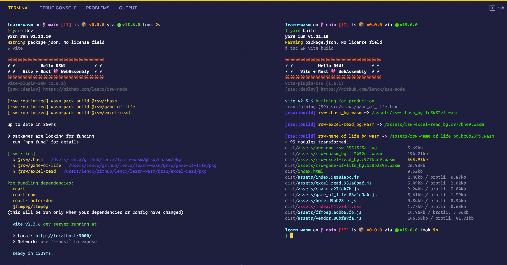
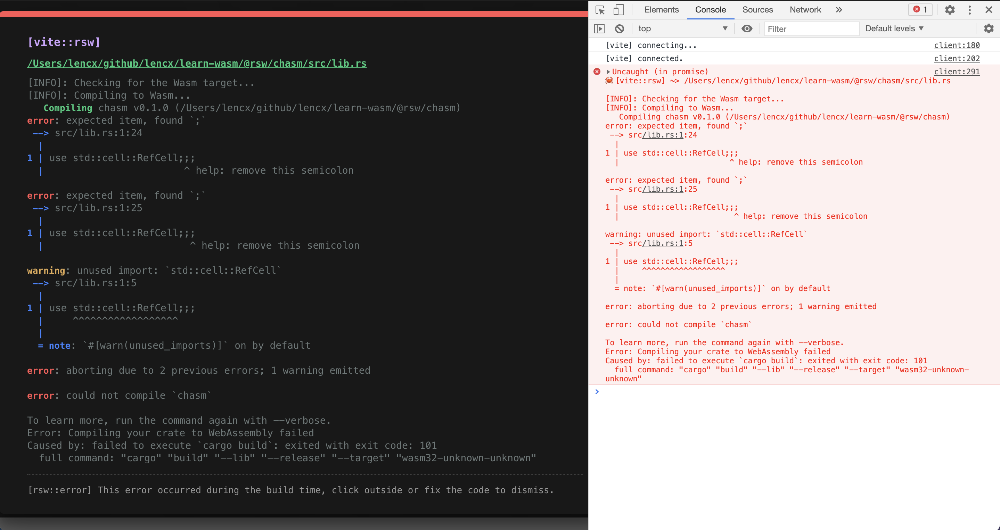

# vite-plugin-rsw

[](https://www.npmjs.com/package/vite-plugin-rsw)
[](https://npmjs.org/package/vite-plugin-rsw)
[](https://github.com/vitejs/vite)
[](https://discord.gg/euyYWXTwmk)

[](https://github.com/lencx/awesome-rsw)
[](https://www.rust-lang.org)
[](https://webassembly.org)

> wasm-pack plugin for vite@v2

## Pre-installed

* [rust](https://www.rust-lang.org/learn/get-started)
* [nodejs](https://nodejs.org)
* [wasm-pack](https://github.com/rustwasm/wasm-pack)

## Features

* startup optimization
* mode: `development build` or `release build`
* generate npm package(library)
* `compile error` output friendly in the browser(hot-update)
* multiple rust crate
  * compile
  * hot-update





## Quick Start

[create-xc-app](https://github.com/lencx/create-xc-app): create a project in seconds!

template: `wasm-vue3` and `wasm-react`

```bash
# With NPM
npm init xc-app

# With Yarn:
yarn create xc-app

# -------------------

# command line options
npm init xc-app my-wasm-app --template wasm-react
```

## Getting Started

### Step1

```bash
# install rsw
npm i -D vite-plugin-rsw

# or
yarn add -D vite-plugin-rsw
```

```js
// vite.config.ts
import { defineConfig } from "vite";
import ViteRsw from "vite-plugin-rsw";

export default defineConfig({
  plugins: [
    ViteRsw({
      // root: '',
      // unLinks: [],
      // isLib: false,
      // libRoot: 'libs',
      mode: "release",
      crates: ["@rsw/hey", "rsw-test"],
    }),
  ],
});
```

### Step2

```bash
# example:
#   npm package: `cargo new --lib rsw-test`
#   npm org    : `cargo new --lib @rsw/hey`
cargo new --lib <crate_name>
```

```toml
# Cargo.toml

# https://github.com/rustwasm/wasm-pack/issues/886
# https://developers.google.com/web/updates/2019/02/hotpath-with-wasm
[package.metadata.wasm-pack.profile.release]
wasm-opt = false

# See more keys and their definitions at https://doc.rust-lang.org/cargo/reference/manifest.html
[lib]
crate-type = ["cdylib", "rlib"]

[profile.release]
lto = true
opt-level = "s"

[dependencies]
wasm-bindgen = "0.2.70"
```

```rust
// src/lib.rs
use wasm_bindgen::prelude::*;

// Import the `window.alert` function from the Web.
#[wasm_bindgen]
extern "C" {
    fn alert(s: &str);
}

// Export a `greet` function from Rust to JavaScript, that alerts a hello message.
#[wasm_bindgen]
pub fn greet(name: &str) {
    alert(&format!("Hello, {}!", name));
}
```

## Plugin Options

* `root`: rust crate root path. default project root path.
* `mode`
  * `dev`: (default) create a development build. Enable debug info, and disable optimizations.
  * `release`: create a release build. Enable optimizations and disable debug info.
* `target`: sets the target environment.
  * `web`: (default)
  * `bundler`
  * `nodejs`
  * `no-modules`
* `unLinks`: `string[]` - (npm unlink) uninstalls a package.
* `isLib`: `boolean` - whether to generate npm package, the default value is `false`.
* `libRoot`: `string` - the root path of the npm package, the default value is `libs`.
* `crates`: `string[]` - (npm link) package name, support npm organization.

> **⚠️ Note:** Before performing the `vite build`, at least once `vite dev`, generate `wasm package (rust-crate/pkg)`. In the project, `wasm package` is installed by `vite-plugin-rsw` in the form of `npm link`, otherwise it will error `Can not find module 'rust-crate' or its corresponding type declarations.`

## Error

* npm ERR! EEXIST: file already exists

  ```bash
  # https://docs.npmjs.com/cli/v6/commands/npm-link
  # npm link uses the global prefix (see npm prefix -g for its value)
  # /Users/lencx/.nvm/versions/node/v15.6.0
  npm prefix -g

  # after removing the folder, try again `npm run dev`
  rm -rf /Users/lencx/.nvm/versions/node/v15.6.0/lib/node_modules/@rsw/chasm
  ```

  

## Examples

* [react](https://github.com/lencx/vite-plugin-rsw/tree/main/examples/react)
* [vue3](https://github.com/lencx/vite-plugin-rsw/tree/main/examples/vue3)
* [learn-wasm](https://github.com/lencx/learn-wasm)

## Related List

* [推荐 - WebAssembly入门](https://lencx.github.io/book/wasm/rust_wasm_frontend.html)
* [Awesome WebAssembly](https://lencx.github.io/book/awesome/wasm.html)

## 微信

> 群二维码已过期，关注公众号《浮之静》，发送“进群”，我将拉你进群一起学习。

 

## License

MIT License © 2021 [lencx](https://github.com/lencx)
