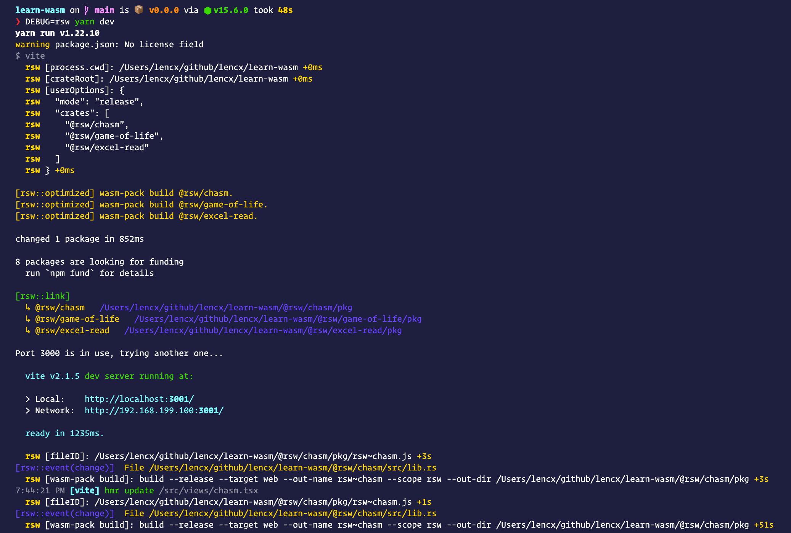
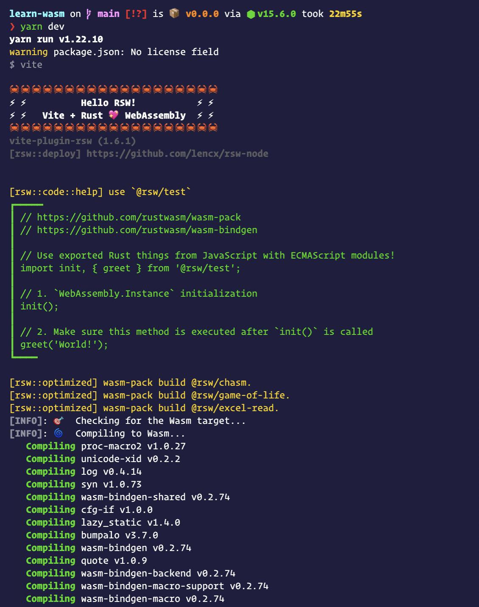
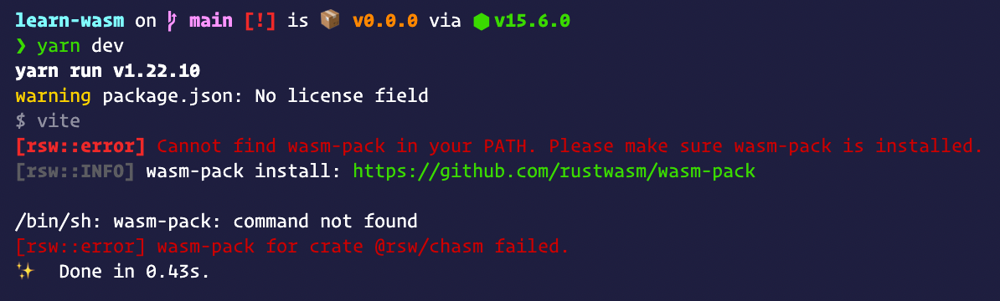
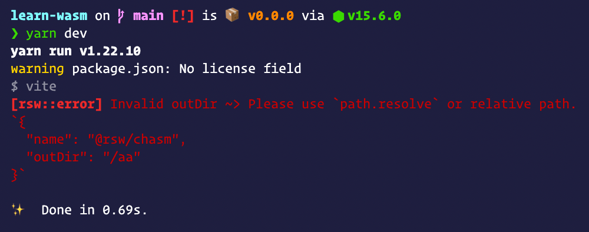
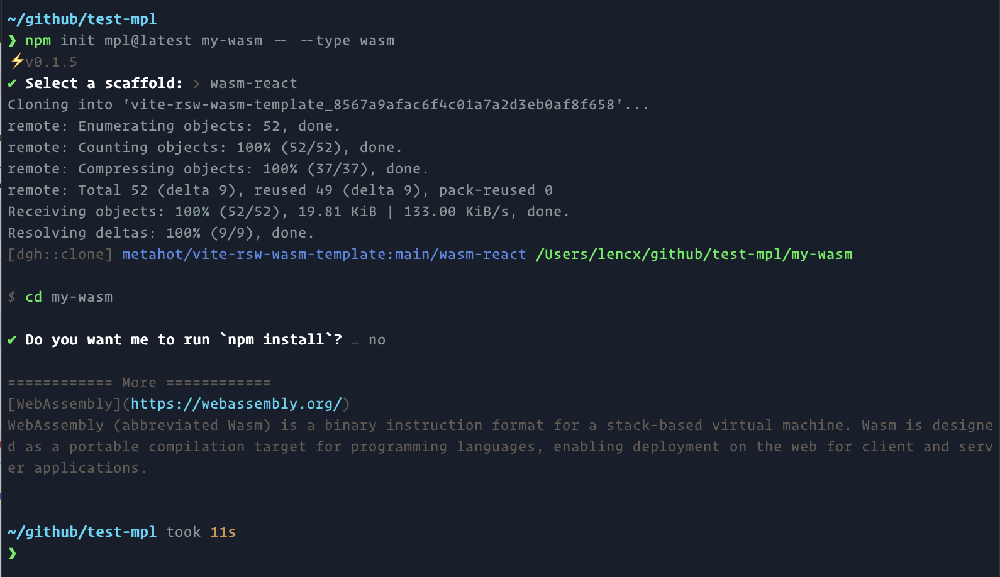
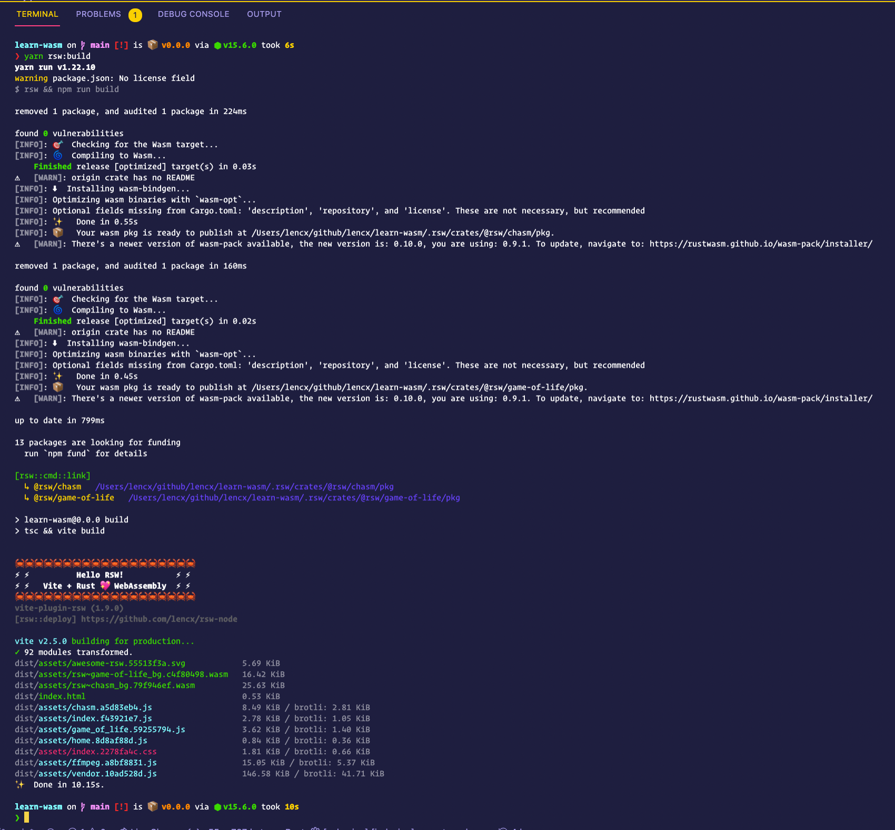

# vite-plugin-rsw

> wasm-pack plugin for Vite

[](https://www.npmjs.com/package/vite-plugin-rsw)
[](https://npmjs.org/package/vite-plugin-rsw)
[](https://github.com/vitejs/vite)
[](https://discord.gg/euyYWXTwmk)

[](https://github.com/lencx/awesome-rsw)
[](https://www.rust-lang.org)
[](https://webassembly.org)

|rsw version|vite version|
|---|---|
| >= `1.8.0`| >= `2.4.0`|
|`1.7.0`|`2.0.0 ~ 2.3.8`|

## Pre-installed

* [rust](https://www.rust-lang.org/learn/get-started)
* [nodejs](https://nodejs.org)
* [wasm-pack](https://github.com/rustwasm/wasm-pack)

## Article

* [中文 - WebAssembly入门](https://lencx.github.io/book/wasm/rust_wasm_frontend.html)
* [Awesome WebAssembly](https://github.com/lencx/awesome/blob/main/WebAssembly.md)

## Features

* startup optimization
* enable debug mode: `DEBUG=rsw yarn dev`
* friendly error message: browser and terminal
* automatically generate template when `crate` does not exist
* multiple rust crate
  * compile
  * hot-update
  * watch for dependent workspace crates ([#18](https://github.com/lencx/vite-plugin-rsw/issues/18))




\
\


## Plugin Options

* `cli`: specified package manager `npm` or `pnpm`, default value `npm`.
* `root`: rust crate root path. default project root path.
* `unLinks`: `string[]` - (npm unlink) uninstalls a package.
* `unwatch`: `string[]` - stop watching files, directories, or glob patterns, takes an array of strings.
* `profile`: `'dev' | 'release' | 'profiling'`, default value `dev`. [wasm-pack build.profile](https://rustwasm.github.io/docs/wasm-pack/commands/build.html#profile)
* `target`: `'bundler' | 'web' | 'nodejs' | 'no-modules'`, default value `web` [wasm-pack build.target](https://rustwasm.github.io/docs/wasm-pack/commands/build.html#target)
* `crates`: [Item[ ]](https://github.com/lencx/vite-plugin-rsw/blob/main/src/types.ts#L46-L50) - (npm link) package name, support npm organization. [wasm-pack build doc](https://rustwasm.github.io/docs/wasm-pack/commands/build.html)
  * *Item as string* - `'@rsw/hello'`
  * *Item as RswCrateOptions* - `{ name: '@rsw/hello', outDir: 'custom/path', unwatch: ['./pkg'] }` use `unwatch` to avoid infinite loops when crate is built in a watched directory [#24](https://github.com/lencx/vite-plugin-rsw/issues/24)
    * `name` - support `--out-name` and `scope`
    * `outDir` - `--out-dir`
    * `target` - `'bundler' | 'web' | 'nodejs' | 'no-modules'`, default value `web`
    * `profile` - `'dev' | 'release' | 'profiling'`, default value `dev`
    * `mode` - `'no-install' | 'normal'`, no default value
    * `extraOpts` - extra options
    * `unwatch` - stop watching files, directories, or glob patterns, takes an array of strings

> **⚠️ Note:** Before performing the `vite build`, at least once `vite dev`, generate `wasm package (rust-crate/pkg)`. In the project, `wasm package` is installed by `vite-plugin-rsw` in the form of `npm link`, otherwise it will error `Can not find module 'rust-crate' or its corresponding type declarations.`

## Quick Start

[create-mpl](https://github.com/lencx/create-mpl): create a project in seconds!

### Step1

```bash
# With NPM
npm init mpl@latest

# With Yarn:
yarn create mpl
```

```bash
# --type, -t: web | wasm | mini | electron | extension | chrome | github

# npm 6.x
npm init mpl@latest my-app --type wasm

# npm 7+, extra double-dash is needed:
npm init mpl@latest my-app -- --type wasm

# yarn
yarn create mpl my-app --type wasm

# pnpm
pnpm create mpl my-app -- --type wasm
```

Currently supported template presets include `wasm-vue3` and `wasm-react`.



### Step2

```bash
cd my-app

npm install

npm run dev
```

### Step3

You can edit the `crates` in `ViteRsw` to create your own rust crates.

```js
// vite.config.ts
import { defineConfig } from 'vite';
import ViteRsw from 'vite-plugin-rsw';

export default defineConfig({
  plugins: [
    ViteRsw({
      crates: [
        '@rsw/hey', // npm org
        'rsw-test', // npm package
        // https://github.com/lencx/vite-plugin-rsw/issues/8#issuecomment-820281861
        // outDir: use `path.resolve` or relative path.
        { name: '@rsw/hello', outDir: 'custom/path' },
      ],
    }),
  ],
});
```

### Step4

Use exported Rust things from JavaScript with ECMAScript modules!

```js
import init, { greet } from '@rsw/hey';

// 1. `WebAssembly.Instance` initialization
init();

// 2. Make sure this method is executed after `init()` is called
greet('World!');
```

## Remote Deployment

```jsonc
{
  "scripts": {
+   "rsw:build": "rsw && npm run build"
  }
}
```

### Example

[lencx/learn-wasm](https://github.com/lencx/learn-wasm/blob/main/package.json)

```json
"scripts": {
  "rsw:build": "rsw && npm run build"
}
```

[.github/workflows/deploy.yml](https://github.com/lencx/learn-wasm/blob/main/.github/workflows/deploy.yml)

```yaml
# .github/workflows/deploy.yml

name: github pages

on:
  push:
    branches:
      - main

jobs:
  deploy:
    runs-on: ubuntu-latest

    steps:
      - uses: actions/checkout@v2
      - uses: actions/setup-node@v2
        with:
          node-version: '14'
      - run: yarn
+     - run: yarn rsw:build # use rsw-node build

      - name: Deploy
        uses: peaceiris/actions-gh-pages@v3
        with:
          github_token: ${{ secrets.GH_TOKEN }}
          publish_dir: ./dist
```



## Video

* [youtube](https://youtu.be/R_lTnYaDRQ4)
* [bilibili (China)](https://www.bilibili.com/video/BV1Pw411f7pr?share_source=copy_web)

## Examples

* [learn-wasm](https://github.com/lencx/learn-wasm)
* [react](https://github.com/lencx/vite-plugin-rsw/tree/main/examples/react)
* [vue3](https://github.com/lencx/vite-plugin-rsw/tree/main/examples/vue3)

## Credits

### [Backers](https://opencollective.com/vite-plugin-rsw)

Thank you to all our backers! 🙏

<a href="https://opencollective.com/vite-plugin-rsw" target="_blank"></a>

## 微信

> 群二维码已过期，关注公众号《浮之静》，发送“进群”，我将拉你进群一起学习。

 

## License

MIT License © 2021 [lencx](https://github.com/lencx)
