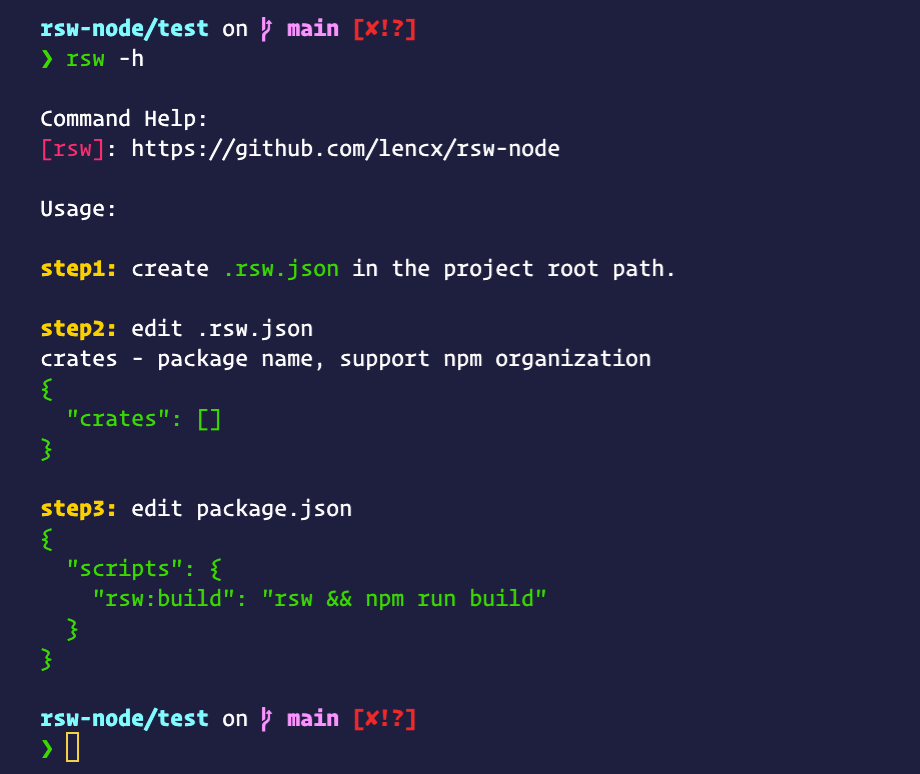
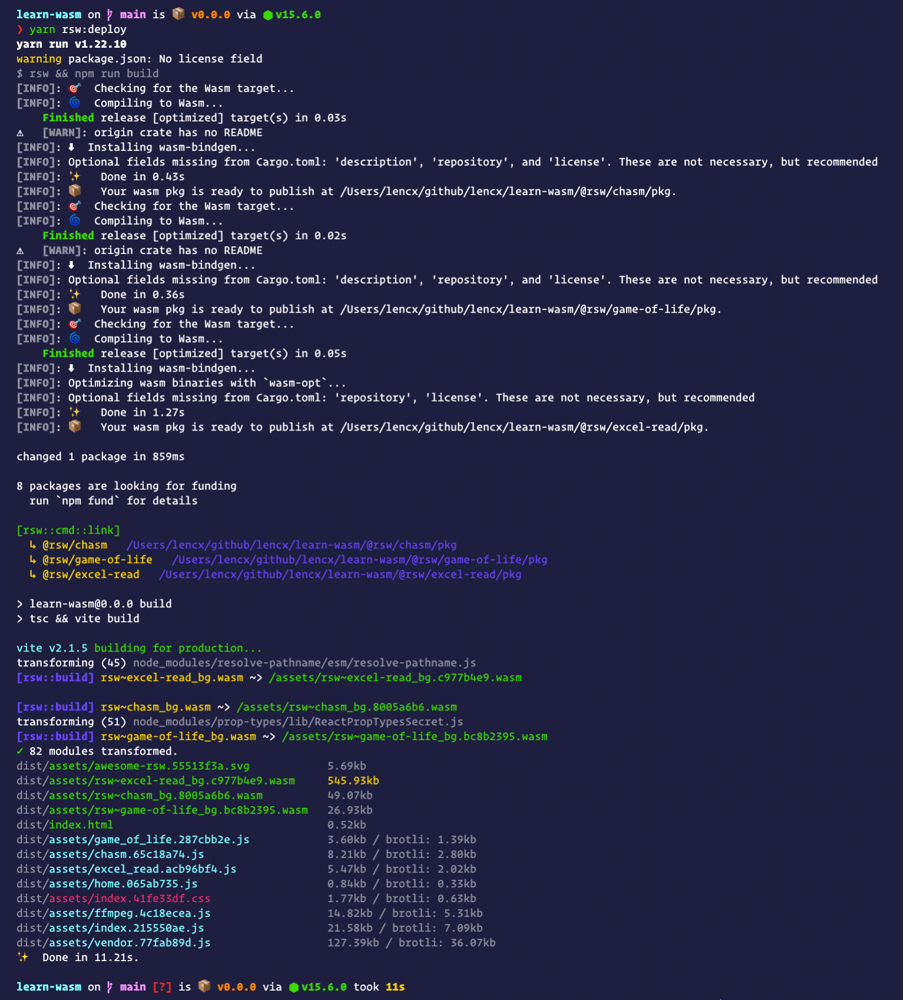
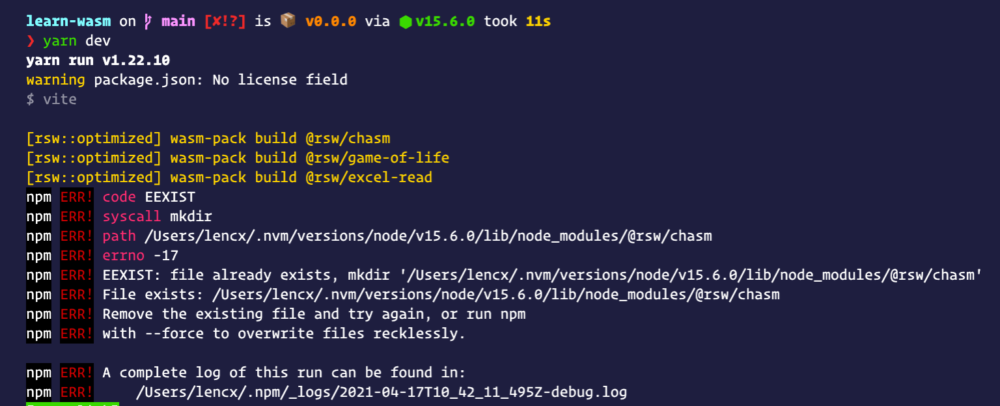

# vite-plugin-rsw

[](https://www.npmjs.com/package/vite-plugin-rsw)
[](https://npmjs.org/package/vite-plugin-rsw)
[](https://github.com/vitejs/vite)
[](https://discord.gg/euyYWXTwmk)

[](https://github.com/lencx/awesome-rsw)
[](https://www.rust-lang.org)
[](https://webassembly.org)

> wasm-pack plugin for vite@v2

## Pre-installed

* [rust](https://www.rust-lang.org/learn/get-started)
* [nodejs](https://nodejs.org)
* [wasm-pack](https://github.com/rustwasm/wasm-pack)

## Features

* startup optimization
* enable debug mode: `DEBUG=rsw yarn dev`
* friendly error message: browser and terminal
* automatically generate template when `crate` does not exist
* multiple rust crate
  * compile
  * hot-update


\
\


## Quick Start

[中文文档 - WebAssembly入门](https://lencx.github.io/book/wasm/rust_wasm_frontend.html)
[WebAssembly 系列](https://github.com/lencx/fzj/discussions/22)

[create-xc-app](https://github.com/lencx/create-xc-app): create a project in seconds!

template: `wasm-vue3` and `wasm-react`

```bash
# With NPM
npm init xc-app

# With Yarn:
yarn create xc-app

# -------------------

# command line options
npm init xc-app my-wasm-app --template wasm-react
```

## Getting Started

### Step1

Install and configure `rsw`.

```bash
# install rsw
npm i -D vite-plugin-rsw

# or
yarn add -D vite-plugin-rsw
```

```js
// vite.config.ts
import { defineConfig } from 'vite';
import ViteRsw from 'vite-plugin-rsw';

export default defineConfig({
  plugins: [
    ViteRsw({
      crates: [
        '@rsw/hey',
        'rsw-test',
        // https://github.com/lencx/vite-plugin-rsw/issues/8#issuecomment-820281861
        // outDir: use `path.resolve` or relative path.
        { name: '@rsw/hello', outDir: 'custom/path' },
      ],
    }),
  ],
});
```

### Step2

Use exported Rust things from JavaScript with ECMAScript modules!

```js
import init, { greet } from '@rsw/hey';

// 1. `WebAssembly.Instance` initialization
init();

// 2. Make sure this method is executed after `init()` is called
greet('World!');
```

## Plugin Options

* `root`: rust crate root path. default project root path.
* `unLinks`: `string[]` - (npm unlink) uninstalls a package.
* `crates`: [Item[ ]](https://github.com/lencx/vite-plugin-rsw/blob/main/src/types.ts#L26) - (npm link) package name, support npm organization.
  * *Item as string* - `'@rsw/hello'`
  * *Item as RswCrateOptions* - `{ name: '@rsw/hello', outDir: 'custom/path' }`

> **⚠️ Note:** Before performing the `vite build`, at least once `vite dev`, generate `wasm package (rust-crate/pkg)`. In the project, `wasm package` is installed by `vite-plugin-rsw` in the form of `npm link`, otherwise it will error `Can not find module 'rust-crate' or its corresponding type declarations.`

## Remote Deployment

### Install

Install [lencx/rsw-node](https://github.com/lencx/rsw-node) globally, you can use the `rsw` command.

```bash
npm i -g rsw-node
```



## Example

* [learn-wasm/package.json](https://github.com/lencx/learn-wasm/blob/main/package.json)

```bash
npm install -D rsw-node
```

  ```json
  "scripts": {
    "rsw:deploy": "rsw && npm run build"
  }
  ```

* [learn-wasm/.rswrc.json](https://github.com/lencx/learn-wasm/blob/main/.rswrc.json)

  ```json
  {
    "root": ".",
    "crates": [
      "@rsw/chasm",
      "@rsw/game-of-life",
      "@rsw/excel-read"
    ]
  }
  ```

* [learn-wasm/.github/workflows/deploy.yml](https://github.com/lencx/learn-wasm/blob/main/.github/workflows/deploy.yml)



## Error

* npm ERR! EEXIST: file already exists

  ```bash
  # https://docs.npmjs.com/cli/v6/commands/npm-link
  # npm link uses the global prefix (see npm prefix -g for its value)
  # /Users/lencx/.nvm/versions/node/v15.6.0
  npm prefix -g

  # after removing the folder, try again `npm run dev`
  rm -rf /Users/lencx/.nvm/versions/node/v15.6.0/lib/node_modules/@rsw/chasm
  ```

  

## Video

* [youtube](https://youtu.be/R_lTnYaDRQ4)
* [bilibili (China)](https://www.bilibili.com/video/BV1Pw411f7pr?share_source=copy_web)

## Examples

* [react](https://github.com/lencx/vite-plugin-rsw/tree/main/examples/react)
* [vue3](https://github.com/lencx/vite-plugin-rsw/tree/main/examples/vue3)
* [learn-wasm](https://github.com/lencx/learn-wasm)

## 微信

> 群二维码已过期，关注公众号《浮之静》，发送“进群”，我将拉你进群一起学习。

 

## License

MIT License © 2021 [lencx](https://github.com/lencx)
